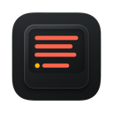
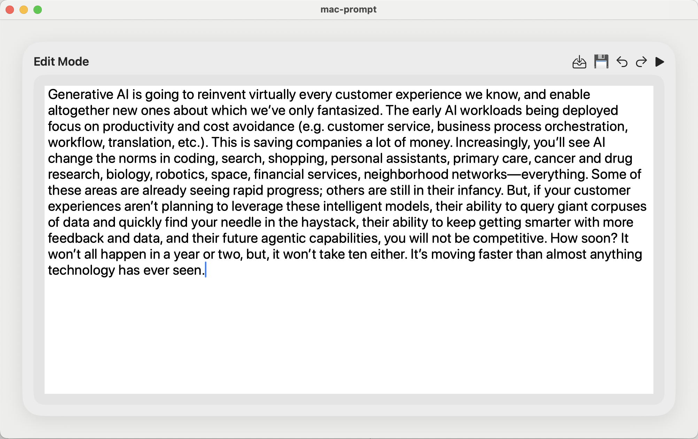
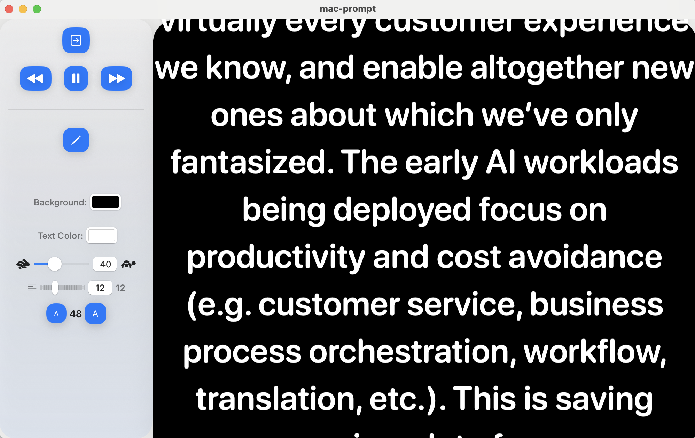

# Mac Prompt



Mac Prompt is a modern teleprompter app for macOS, built with SwiftUI. It allows you to smoothly scroll and control your script text, making it perfect for presentations, content creation, and speeches.

## Features
- Smooth, customizable scrolling text
- Keyboard shortcut (Space) to pause/resume scrolling
- Adjustable font size, colors, and line spacing
- Sidebar controls for easy navigation
- Edit mode for quickly updating your script

## Getting Started
1. Clone the repository:
   ```sh
   git clone https://github.com/yourusername/mac-prompt.git
   ```
2. Open `mac-prompt.xcodeproj` in Xcode.
3. Build and run the app on your Mac.

## Keyboard Shortcuts
- **Space**: Pause/resume scrolling

## Screenshots




## License
MIT License

---

Made with ❤️ for creators and presenters.
