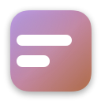
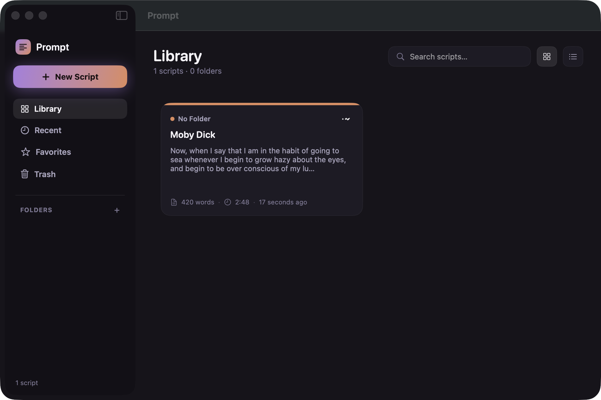
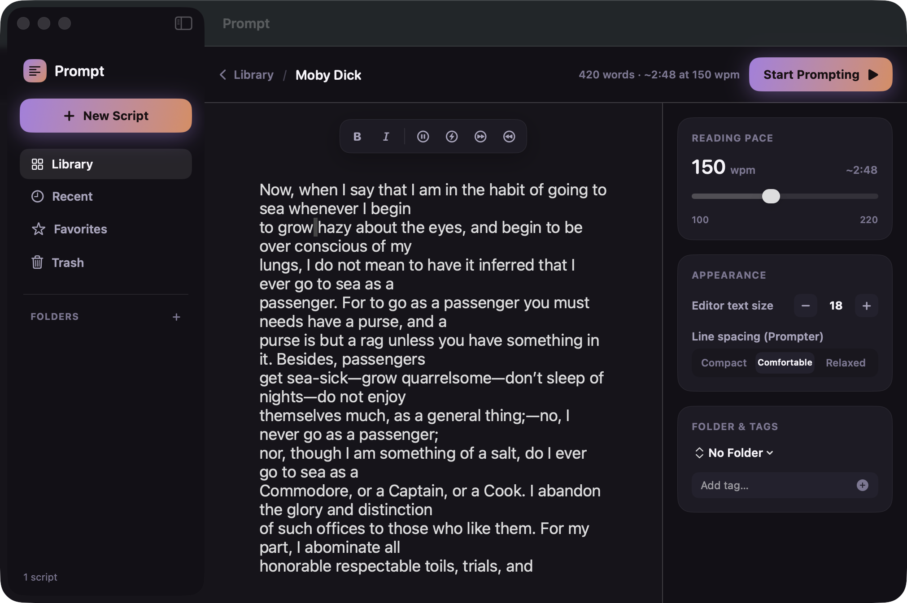
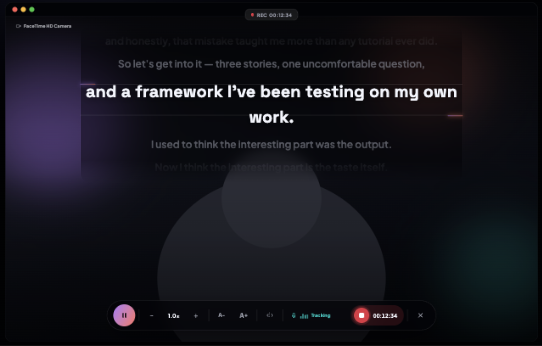

# Prompt



Prompt is an open-source teleprompter for macOS, built with SwiftUI and SwiftData. It manages a
library of scripts across folders, gives each script a rich editing view with pacing cues, and
reads them back in an immersive full-screen prompter with optional camera passthrough,
recording, and mic-driven voice tracking.

## Features

- **Library**: every script lives in a searchable, folder-organized grid, with Recent,
  Favorites, and Trash smart folders
- **Editor**: syntax-highlighted cue markers (`[PAUSE]`, `[EMPHASIS]`, `»» FASTER`, `«« SLOWER`)
  and light markdown emphasis, a reading-pace panel that estimates read time from your
  words-per-minute target, per-script appearance (editor size, line spacing), folder and tag
  assignment
- **Prompter**: full-screen scrolling teleprompter with a floating glass control bar. Play/pause,
  speed, font size, mirror flip (for physical beam-splitter rigs), and keyboard shortcuts for
  everything
- **Camera passthrough and recording**: an optional live camera background behind the script,
  with one-click recording and a "reveal in Finder" shortcut once a take finishes
- **Voice tracking**: on-device speech recognition measures your actual speaking pace and gently
  nudges the scroll speed to match it as you read (see
  [How voice tracking works](#how-voice-tracking-works) below)
- **Settings**: a proper multi-tab preferences window. General, Reading & Display, Voice
  Tracking, Camera & PiP, and Shortcuts

## Getting Started

**Option 1: download the app.** Grab the latest DMG from
[Releases](https://github.com/tilakp/mac-prompt/releases/tag/latest-release), open it, and drag
Prompt into Applications. Since it isn't notarized or signed with a paid Apple Developer account,
the first launch needs a right-click then Open (or System Settings, Privacy & Security, "Open
Anyway") to get past Gatekeeper.

**Option 2: build from source.**
1. Clone the repository:
   ```sh
   git clone https://github.com/tilakp/mac-prompt.git
   ```
2. Open `mac-prompt.xcodeproj` in Xcode.
3. Build and run the app on your Mac.

Either way, the first time you open Prompter mode with camera passthrough or voice tracking
enabled, macOS will ask for Camera, Microphone, and Speech Recognition permission. Recordings
are saved into the app's own sandboxed storage
(`~/Library/Containers/com.patelt.mac-prompt/Data/Documents/Recordings`). Use the folder icon
that appears next to the record button once a take finishes to jump straight to it in Finder.

## How voice tracking works

Voice tracking does **not** attempt to align the scroll position to the exact word you're
speaking. That's a much harder, research-grade alignment problem. Instead, it runs live
on-device speech recognition, measures your actual words-per-minute since the current
recognition session started, and smoothly nudges the scroll speed toward that measured rate.
Sensitivity (Low/Balanced/High) in Settings controls how quickly it reacts.

## Keyboard Shortcuts (Prompter mode)

| Action | Key |
| --- | --- |
| Play / Pause | Space |
| Speed up | ↑ |
| Speed down | ↓ |
| Start / Stop recording | R |
| Mirror flip | M |
| Exit prompter | Esc |

## Screenshots

**Library**: every script in one searchable, folder-organized grid.



**Editor**: cue markers, a reading-pace panel, and per-script appearance controls.



**Prompter**: camera passthrough, recording, and voice tracking behind the scrolling script.
(Design concept shown below. Camera passthrough is a live feed of you, not a stock image.)



## License
MIT License

---

Made with ❤️ for creators and presenters.
